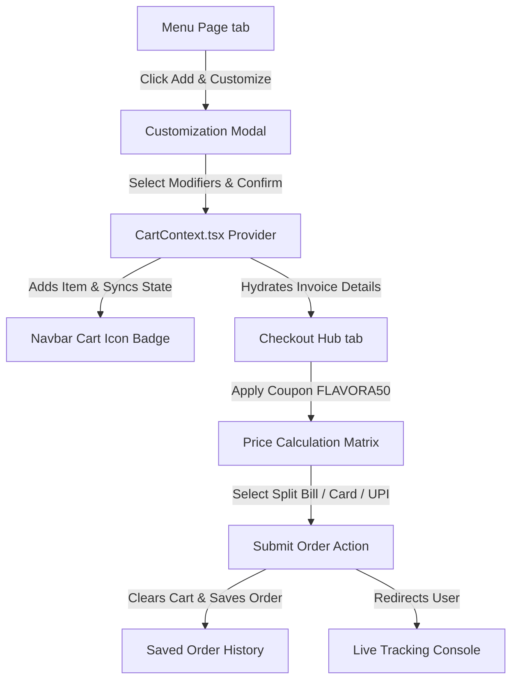

# 🍔 Gourmet Online Order System

**Last updated: June 28, 2026**

This document details the design, state structures, user workflows, and codebase integration for the **Online Order System** of Flavora Kitchen.

---

## 🧭 System Overview

The Online Order System allows authenticated customers to search, sort, filter, and customize gourmet items from our catalog, add them to a global shopping cart, perform checkout pricing calculations, split the bill with friends, and place orders.

```
+------------------+     +-------------------+     +---------------------+
|  Gourmet Catalog | --> | Customize Modal   | --> | Cart Drawer         |
|  Search/Filters  |     | Sizes/Spice/Crust |     | Add / Remove / Qty  |
+------------------+     +-------------------+     +---------------------+
                                                              |
                                                              v
+------------------+     +-------------------+     +---------------------+
| Live Order       | <-- | Submit Invoice &  | <-- | Checkout Hub Tab    |
| Tracker Console  |     | Payment / Split   |     | Subtotal / Tip / GST|
+------------------+     +-------------------+     +---------------------+
```

---

## 🧩 Key Subsystems & Features

The ordering system is accessible via the **Dashboard** protected portal under the `menu` and `checkout` tabs.

### 1. Menu Search & Multi-Filter Matrix
Located in [DashboardPage.tsx](file:///d:/Client%20Projects/foodie-flavors-restaurant-main/flavora-kitchen/src/pages/DashboardPage.tsx) (`activeTab === "menu"`):
* **Text Search**: A text input allowing users to search by dish names or key ingredients in real-time.
* **Sort Engine**: A dropdown select supporting options:
  - `relevance`: Default sorting.
  - `rating`: Sorted descending by user rating stars (`dish.rating`).
  - `popularity`: Sorted descending by total order volume (`dish.popularity`).
  - `costLow`: Sorted ascending by price (`dish.price`).
  - `costHigh`: Sorted descending by price.
* **Dietary Category Switcher**: Filters dishes by dietary attributes:
  - `All Diets`
  - `🟢 Veg` (`dish.isVeg === true`)
  - `🔴 Non-Veg` (`dish.isVeg === false`)
  - `🍀 Vegan` (`dish.isVegan === true`)
* **Price Tier Constraints**:
  - `Any Price`
  - `Under ₹300` (`dish.price <= 300`)
  - `Under ₹500` (`dish.price <= 500`)
* **Horizontal Category Selector Tabs**: Switches menu groups smoothly utilizing Framer Motion layout transition pill shapes: `All`, `Starters`, `Main Course`, `Desserts`, `Drinks`.

### 2. Gourmet Item Customization Modal
When a user clicks "Add & Customize" or a dish title, it opens the interactive customization overlay:
* **Interface Definition**: `CustomizationOptions` maps customized modifiers:
  ```typescript
  interface CustomizationOptions {
    size: "Small" | "Medium" | "Large" | "Regular";
    crust: "Thin" | "Cheese Burst" | "Pan" | "None";
    toppings: string[];
    spiceLevel: "Mild" | "Medium" | "Spicy";
    extras: string[];
    instructions: string;
  }
  ```
* **Size Selectors**: Select between Small, Medium, Large, and Regular.
* **Crust Modifiers**: Select between Thin Crust, Cheese Burst, Pan, or None (where inapplicable).
* **Toppings & Extras Checklists**: Interactive checkboxes modifying choices, adding price offsets where selected.
* **Spice Level Toggles**: Rated as Mild, Medium, and Spicy.
* **Cooking Instructions**: Text input field passing custom instructions directly to the chef.

### 3. Shopping Cart Context Provider
Global state coordinates additions via [CartContext.tsx](file:///d:/Client%20Projects/foodie-flavors-restaurant-main/flavora-kitchen/src/context/CartContext.tsx):
* **`cart` (CartItem[])**: Persistent state holding active selections.
* **`addToCart(item)`**: Validates item fields, increments count if identical match exists, and plays synthesized **Web Audio API** double-ascending C5-E5 chime notes (`playAddToCartSound()`).
* **`updateQuantity(id, qty)`**: Updates item quantities. If quantity falls below 1, removes the item.
* **`cartTotal` / `cartCount`**: Computed properties supplying checkout metrics.

### 4. Billing & Platform Pricing Calculations
On checkout, the system compiles fee matrices dynamically before generating the final invoice:
* **Subtotal**: Sum of all items × quantities.
* **GST / Tax**: Calculated at a flat `5%` of the subtotal.
* **Platform Fee**: Fixed at `₹10` per order.
* **Delivery Fee**: Fixed at `₹40` (free delivery promotions apply dynamically).
* **Rider Tips**: Optional tips (₹10, ₹20, ₹30, ₹50, or custom amounts) paid fully to the courier.
* **Coupon Discounts**: Validates the promo code `FLAVORA50` to apply a **50% discount** off the cart items total.

### 5. Checkout Payment Channels
* **UPI (Unified Payments Interface)**: Simulated scan QR / address input.
* **Credit / Debit Cards**: Secure layout checks simulating payment validation.
* **Cash on Delivery (COD)**: Bypasses immediate transaction verification.
* **Split Bill Calculator**:
  - Allows customers to divide the total invoice cost among up to 10 friends.
  - Computes exact share values per head: `Math.round(totalAmountPayable / splitCount)`.
  - Prompts for a primary invite mobile number to simulate sending payment request triggers to split-payers.

---

## ⚙️ Data Flow & State Synchronization



## 📂 Core Code References
* **Context Provider**: [CartContext.tsx](file:///d:/Client%20Projects/foodie-flavors-restaurant-main/flavora-kitchen/src/context/CartContext.tsx) — Cart array, quantity triggers.
* **Menu Rendering**: [DashboardPage.tsx](file:///d:/Client%20Projects/foodie-flavors-restaurant-main/flavora-kitchen/src/pages/DashboardPage.tsx) (Lines 1354 - 1556) — Layout sorting and categories logic.
* **Checkout Hub**: [DashboardPage.tsx](file:///d:/Client%20Projects/foodie-flavors-restaurant-main/flavora-kitchen/src/pages/DashboardPage.tsx) (Lines 1957 - 2310) — Billing matrix, address system, split bills.
* **Modals**: [DashboardPage.tsx](file:///d:/Client%20Projects/foodie-flavors-restaurant-main/flavora-kitchen/src/pages/DashboardPage.tsx) (Lines 2885 - 3060) — Customization dialog rendering.
