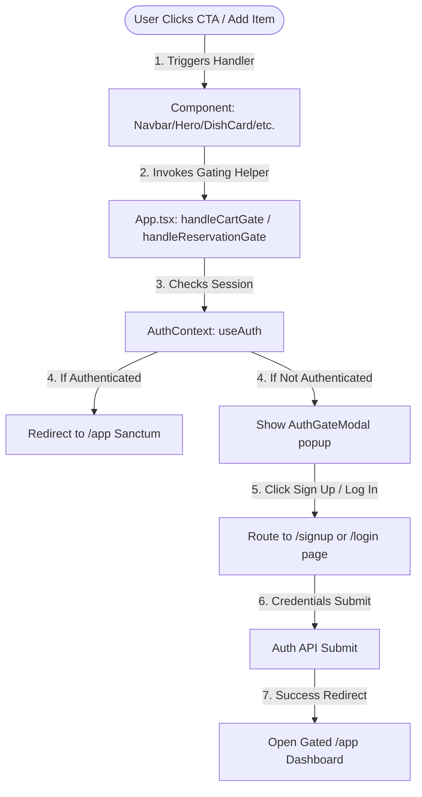

# 🔄 State & Data Flow Architecture

**Last updated: June 28, 2026**

This document describes how state is managed in **Flavora Kitchen**, how data flows between parent and child components, and how components synchronize in real-time.

---

## 🔑 Active State Management

The application coordinates layout states, item states, and visual configurations using a combination of **React Context API**, **React hooks**, and **Framer Motion spring values**.

### 1. Global Authentication & Session State (`AuthContext.tsx`)
A unified `AuthProvider` wraps the application router and distributes session properties and callback methods:
* **`user` (User | null)**: The active authenticated user object (containing email, ID, and metadata).
* **`session` (Session | null)**: The active Supabase or mock session token structure.
* **`loading` (boolean)**: Indicates whether the auth session is loading, preventing layout flashing on mount.
* **`login(email, password)`**: Authenticates user credentials.
* **`signup(email, password, name)`**: Creates a new user profile.
* **`logout()`**: Invalidates the current session and clears storage.
* **`isRealAuth` (boolean)**: True if connected to a live Supabase server, false if running in Mock Fallback mode.

### 2. Global Shopping Cart State (`CartContext.tsx`)
A global `CartProvider` manages active items and calculations. Gated behind authentication, it is fully integrated inside `/app` (DashboardPage.tsx) to power the Checkout Hub:
* **`cart` (array of CartItem)**: Holds active order dishes, quantities, and serial configurations.
* **`addToCart(dish)`**: Appends a dish or increments quantity.
* **`removeFromCart(id)`**: Clears a dish index from the list.
* **`updateQuantity(id, qty)`**: Modifies item quantities directly.
* **`clearCart()`**: Reverts the array to empty (called after completing checkout).
* **`cartCount` (number)**: Total items in the cart.
* **`cartTotal` (number)**: Total cost of cart items.

### 3. Gated Operations Dashboard States (`DashboardPage.tsx`)
Coordinates all interactive flows inside the protected portal:
* **Table Reservation Configs** (See the detailed [Dine-In Table Seating Reservation Guide](file:///d:/Client%20Projects/foodie-flavors-restaurant-main/documentation/table_booking_system.md)):
  - `savedBookings` (Booking[]): List of active/completed table bookings synced to `localStorage`.
  - `bookingDate`, `bookingTime`, `bookingGuests`, `bookingDuration`, `bookingTableType`, `bookingTableId`: Manage active configuration selections in the table reservation wizard.
  - `bookingPackage` (string): Standard vs surcharge gala packages (Romantic, Family, Tasting, Chef).
  - `bookingRequests` (string[]): Checklist of special requests (Birthday setups, baby chairs).
  - `showRescheduleModal`, `showUpgradeModal`, `showAddGuestsModal`, `showFeedbackModal`: Modulate popups for managing active table bookings.
  - `feedbackFoodScore`, `feedbackAmbienceScore`, `feedbackServiceScore`, `feedbackComment`: Manage ratings reviews scorecards.
* **Live Telemetry & GPS Tracking** (See the detailed [Live Telemetry & GPS Tracking Guide](file:///d:/Client%20Projects/foodie-flavors-restaurant-main/documentation/live_tracking_system.md)):
  - `activeOrder` (Order | null): Currently tracked order data synced to `localStorage`.
  - `mapProgress` (number): Holds the percentage offset (0 to 100) of the scooter vehicle along the SVG street map roads.
* **Loyalty Reward Points**:
  - `loyaltyPoints` (number): Tracks reward points balance. Spend ₹100 to earn 10 points on checkout, and redeem points for coupons.
* **Support Concierge Help Desk**:
  - `supportMessages` (ChatMessage[]): Thread logs for the support chatbot synced to `localStorage`.
  - `chatInput` (string): Text buffer for user inputs.
  - `isChatTyping` (boolean): Triggers the bot's typing bubbles delay animation.
* **Delivery Destination Address System** (See the detailed [Gourmet Online Order System Guide](file:///d:/Client%20Projects/foodie-flavors-restaurant-main/documentation/online_order_system.md)):
  - `savedAddresses` (Address[]): Home, Work, and Friend's House address list.
  - `selectedAddressId` (string): Selection index for delivery routing.
  - `gpsSimulating` (boolean) & `simulatedCoords` (lat/lng): Manage simulated coordinates pin placement on map.

### 4. Global Favorites State (`FavoritesContext.tsx`)
A dedicated `FavoritesProvider` persists dish wishlist selections across sessions:
* **`favorites` (string[])**: Array of dish IDs the user has hearted. Initialised from and synced to `localStorage("flavora_favorites")`.
* **`toggleFavorite(dishId)`**: Adds the ID if absent; removes it if already present.
* **`isFavorited(dishId)`**: Returns a boolean for conditional heart-icon fill rendering.
* **Persistence**: Any update to `favorites` triggers a `useEffect` that serialises the array back to localStorage. Available across the entire app without re-fetching.

### 5. Interaction Audio State (`sounds.ts` & `Navbar.tsx`)
* **Mute/Unmute State**: Tracks speaker toggles (`isMuted` boolean).
* **Sync & Persistence**: Synchronized in real-time via local storage (`localStorage.getItem("flavora_muted")`), preserving options across visits.

### 6. Layout & Presentation States (`App.tsx`)
* **`loading` (boolean)**: Controls the entrance loader overlay.
* **`authGateOpen` (boolean)**: Triggers the display of `AuthGateModal` when unauthenticated users attempt to perform transactional actions.
* **`toastVisible` (boolean)**: Controls toast notification popups.

---

## 🚀 Data Flow Map

### Public Landing Page Gating Flow Detail:
1. **Trigger**: User clicks any action button (such as a dish card's `+`, "Order Now" in Hero, "Book Table" in Navbar, or "Reserve This Dish" in Chef's Special).
2. **Gating Check**: The component fires its callback which propagates to `handleCartGate` or `handleReservationGate` in `App.tsx`.
3. **Authentication Check**:
   - **Case A: Unauthenticated**: The helper opens the `AuthGateModal` overlay, prompting the user to create a free account or log in. Clicking these links routes the user cleanly to `/signup` or `/login`.
   - **Case B: Authenticated**: The helper automatically redirects the user to the protected `/app` dashboard route.
4. **App Login/Signup**:
   - The user fills out form fields in `/login` or `/signup`.
   - On submit, the form invokes `login()` or `signup()` from `AuthContext`.
   - Once successfully authenticated, the router redirects the user to `/app` where their session details (e.g. customized name display, logout triggers) are loaded.

---

## 📦 Utility Libraries & Data Config

### `src/lib/deliveryZone.ts`
Exports `getDeliveryZone(coords)` and the `haversineKm()` Haversine formula. Called reactively in the Checkout Hub whenever the selected delivery address changes. Returns `{ distanceKm, status, fee, label, eta }`. Hardcoded restaurant origin at `{ lat: 19.4180, lng: 72.8200 }` with a `TODO` to replace with a config service call.

### `src/lib/plannerSolver.ts`
Exports `solveMealPlan()` which runs a greedy knapsack algorithm over the dish dataset to find a budget-optimal meal combination matching dietary filters, occasion type, and guest counts. Returns `MealPlanResult` with selected items, total price, and a nutritional score. Also exports `getMappedDishes()` which maps raw `DISH_DATA` into typed `MappedDish` arrays consumable by the solver.

### `src/config/vouchers.ts`
Defines the `VOUCHERS` array of type `Voucher[]` with four redeemable codes: `FLAVORA50` (50% percent), `WELCOME100` (flat ₹100), `FREESHIP` (waives delivery fee), and `BDAY2026` (flat ₹150). Each entry contains `code`, `type`, `value`, and `description`. The checkout engine validates input against this array and computes discounts by type.

### `src/lib/sounds.ts`
Provides `playAddToCartSound()` (ascending C5-E5 chime), `playDrawerOpenSound()` (triangle wave sweep), and `playTimerTickSound()` (1400 Hz tick). All functions check `localStorage.getItem("flavora_muted")` before creating an `AudioContext` node — zero-latency and zero file-weight.

---

## 🔄 Tier 2 State Additions

The following state groups were added to `DashboardPage.tsx` for the Tier 2 feature pass:

| State Variable | Type | Purpose |
|---|---|---|
| `userProfile` | `UserProfile` | Editable user personal profile data |
| `profileEditMode` | `boolean` | Toggles profile view / edit mode |
| `profilePhoto` | `string \| null` | Simulated avatar upload URL |
| `waitlist` | `WaitlistEntry[]` | Table waitlist queue, localStorage-persisted |
| `waitlistName/Phone/Guests` | `string / number` | Join-waitlist form buffers |
| `groupMembers` | `GroupOrderMember[]` | Collaborative group order member list |
| `groupLink` | `string` | Shareable group session URL |
| `groupOrderActive` | `boolean` | Group order mode toggle |
| `deliveryZoneResult` | `DeliveryZoneResult \| null` | Real-time Haversine zone check result |
