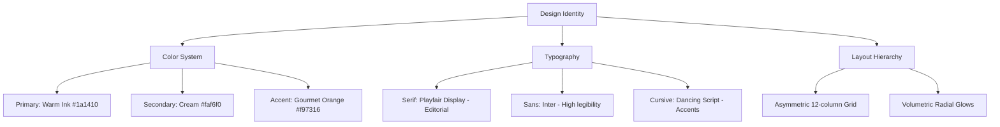
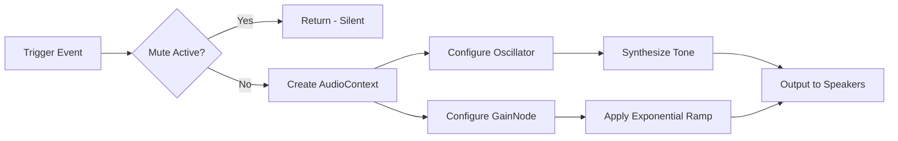

# 🎨 UI/UX Design System & Implementation (Landing Page)

**Last updated: June 28, 2026**

This document provides a comprehensive technical breakdown of the UI/UX design decisions, color systems, typography, micro-interactions, and visual effects implemented across the **Flavora Kitchen** landing page.

---

## 🏛️ 1. Core Visual Design Identity

The Landing Page adheres to a **luxury-minimalist culinary aesthetic**. It balances rich, dark backgrounds with clean, high-contrast cream spaces, highlighted by warm gourmet accents.



### 1.1 Color Palette
The color system is defined directly in [index.css](file:///d:/Client%20Projects/foodie-flavors-restaurant-main/flavora-kitchen/src/index.css) using CSS custom properties inside a modern Tailwind `@theme` block:
*   **Warm Ink** (`#1a1410`): A rich, near-black charcoal tone with subtle brown undertones. It forms the background for all dark components (Hero, Footer, CartDrawer, active Categories) and gives the site an premium, intimate restaurant ambiance.
*   **Cream** (`#faf6f0`): A soft, off-white hue. It serves as the primary canvas background (App, Categories, PopularDishes) to prevent the harsh glare of generic white `#ffffff` and create a organic, paper-like elegance.
*   **Gourmet Orange** (`#f97316`): The primary interactive accent. Used for CTAs, active selections, badges, and highlights.
*   **Gourmet Red/Amber/Teal/Lime/Purple**: Dynamic secondary category accents to represent different food profiles (e.g., Spicy Red for Pizza, Lime for Italian Pasta, Purple for Starters).

### 1.2 Typography System
*   **Serif Font**: **Playfair Display** (weights 400 through 900). Imported from Google Fonts. Used for major headings, italicized words, pricing displays, and hero titles. This lends an editorial, magazine-like, Michelin-star feel.
*   **Sans-Serif Font**: **Inter**. Used for body copy, buttons, labels, and forms. It provides clean, neutral readability to balance the high-character Serif headings.
*   **Cursive Font**: **Dancing Script** (weight 700). Reserved for personal touches (e.g., the chef's signature in `ChefsSpecial.tsx`).

---

## ⚡ 2. Branded Entry Experience (The Loader)

To set an immediate premium tone, the application mounts a custom full-screen loader overlay inside [App.tsx](file:///d:/Client%20Projects/foodie-flavors-restaurant-main/flavora-kitchen/src/App.tsx) before revealing the main layout.

```
+-------------------------------------------------+
|  [Truffle Polaroid]                             |  <-- Floating AI Composition I (Left)
|                                                 |
|                   WELCOME TO                    |  <-- Welcome header (tracking-[0.6em])
|                    FLAVORA                      |  <-- Giant title (text-7xl to text-9xl)
|             KITCHEN & GASTRONOMY                |  <-- Subtitle (tracking-[0.5em])
|                       •                         |  <-- Premium gold divider dot
|           "A sanctuary of culinary..."          |  <-- Enriched italic slogan
|                                                 |
|                [=============>       ]          |  <-- Shimmering progress bar (0% -> 100%)
|                  Loading 56%                    |
|                              [Feast Polaroid]   |  <-- Floating AI Composition II (Right)
+-------------------------------------------------+
```

### Key Implementation Mechanics:
1.  **Editorial AI Food Compositions**: Two high-fidelity, AI-generated food scene photos are framed as floating polaroid-style cards:
    *   *Left Card (Composition I: Truffle Symphony)*: Showcases `/images/truffle_dish.png` (Michelin-star truffle pasta scene). Positioned on the top-left, rotated at `-8deg` on mount.
    *   *Right Card (Composition II: Grand Feast Spread)*: Showcases `/images/combo_deal.png` (gourmet table spread of burgers, pizza, and sides). Positioned on the bottom-right, rotated at `8deg` on mount.
    *   *Floating Drift*: Animated with desynchronized sine-wave vertical translation and rotation loops (`14s` and `16s` durations) to simulate high-end drifting frames.
2.  **Enriched Typographic Layout**:
    *   `WELCOME TO` header is styled in orange with high letter spacing.
    *   `FLAVORA` brand title is rendered in giant Playfair Display text (`text-7xl sm:text-8xl md:text-9xl lg:text-[7.5rem]`).
    *   `KITCHEN & GASTRONOMY` subtitle uses a tracked uppercase sans-serif layout.
    *   `•` (Divider Dot) serves as an elegant visual separator in gold (#d4af37).
    *   *Slogan*: An italicized culinary quote is rendered in Playfair Display (`text-cream/70`).
3.  **Entrance Animation Choreography**:
    *   All typographic elements stagger in sequentially (`0.4s`, `0.6s`, `1.0s`, `1.1s`, and `1.2s` delay offsets) using smooth cubic-bezier fades.
4.  **Iris Reveal Exit**: On completion (3s progress bar duration), the loader exits using Framer Motion's `AnimatePresence`. It executes a smooth **circular clip-path transition** that starts at `circle(150% at 50% 50%)` and closes down to `circle(0% at 50% 50%)` over `1.0s` using a custom cubic bezier easing curve `[0.76, 0, 0.24, 1]`.
5.  **Shimmering Progress Bar**: A `56px` wide bar grows to `100%` in sync with the state over `3.0s`. An infinite gradient animation moves the background position horizontally to create a premium shimmer effect.
6.  **Session-Level Persistence**: Maintained via `sessionStorage` (`flavoraLoaderPlayed`), ensuring the splash screen only plays once per session for the visitor. Developers can append `?forceLoader=true` to force a replay.

---

## 🎡 3. WebGL 3D Plate Slider (Hero Scene)

The primary visual driver of the landing page is the asymmetric 3D Plate Slider inside [Hero.tsx](file:///d:/Client%20Projects/foodie-flavors-restaurant-main/flavora-kitchen/src/components/Hero.tsx) and [Hero3DScene.tsx](file:///d:/Client%20Projects/foodie-flavors-restaurant-main/flavora-kitchen/src/components/Hero3DScene.tsx).

```
 12-Column Asymmetric Grid Layout
+---------------------------------------------------------------------------------+
|                                       |                                         |
|                                       |                                         |
|    COLUMN 1 to 7:                     |   COLUMN 8 to 12:                       |
|    Gourmet Typography                 |   React Three Fiber 3D Canvas           |
|                                       |                                         |
|    * Subtitle Tag                     |   +-------------------------------+     |
|    * Asymmetric Serif Heading         |   |                               |     |
|    * Slide Description Text           |   |       ( Cream Plate )         |     |
|    * Dual Magnetic CTAs               |   |     ( Food Photo Texture )    |     |
|    * Review Badging / Stars           |   |       ( Gold Outer Rim )      |     |
|    * Capsule Slider Indicators        |   |                               |     |
|                                       |   +-------------------------------+     |
|                                       |                                         |
+---------------------------------------------------------------------------------+
```

### 3.1 Plate Composition & Layering
Each dish model is synthesized dynamically inside [Hero3DScene.tsx](file:///d:/Client%20Projects/foodie-flavors-restaurant-main/flavora-kitchen/src/components/Hero3DScene.tsx) using Three.js primitive meshes stacked tightly on the Z-axis:
1.  **Gourmet Food Layer**: A `<circleGeometry args={[1.70, 64]}>` positioned at `Z = 0.005` mapped with a high-resolution food PNG texture loaded via `TextureLoader`. Filters (`minFilter = THREE.LinearFilter`, `generateMipmaps = false`) are optimized for sharp rendering.
2.  **Cream Plate Rim**: A `<circleGeometry args={[1.78, 64]}>` positioned at `Z = -0.01` styled with a highly reflective white material (`color="#faf6f0"`, `roughness={0.15}`).
3.  **Gold Accent Outer Rim**: A `<circleGeometry args={[1.81, 64]}>` positioned at `Z = -0.015` styled with a high-metalness gold material (`color="#d4af37"`, `metalness={0.8}`, `roughness={0.1}`).
4.  **Drop Shadow Mesh**: A `<circleGeometry args={[1.81, 64]}>` offset at `[0.07, -0.07, -0.03]` rendered in black at `15%` opacity (`transparent`, `opacity={0.15}`).

### 3.2 Slide Transition Mechanics
When the slides advance (either automatically via a 5-second interval or manually by clicking indicators), the coordinates translate horizontally using a cubic ease-out curve (`1 - Math.pow(1 - progress, 3)`) over approximately `0.45` seconds:
*   **Outgoing Plate**: Translates from center `X = 0` to `X = -direction * 4.8` while its scale decreases slightly (`1` to `0.75`) and opacity fades out.
*   **Incoming Plate**: Slides in from `X = direction * 4.8` to `X = 0`, expanding from `scale = 0.75` to `1` and opacity fading in.
*   **Direction Detection**: Calculated dynamically using loop-aware arithmetic. Moving from index `9` to `0` detects as forward (`direction = 1`), while `0` to `9` detects as backward (`direction = -1`).

### 3.3 Mouse Tilt & Performance Guarding
*   **Mouse-Tilt Physics**: A `useFrame` hook tracks the mouse cursor coordinates mapped from R3F's `state.pointer` (normalized range `[-1, 1]`). The plate translates these coordinates into a subtle tilt rotation (`rotation.x = -mouseY * 0.04`, `rotation.y = mouseX * 0.04`) smoothed via linear interpolation (`lerp` with a factor of `0.05`) to create a fluid, responsive 3D response.
*   **Device Pixel Ratio (DPR) Locking**: The Canvas is locked to `dpr={[1, 1]}`. This eliminates micro-stuttering and prevents WebGL context loss on high-DPI displays (Retina, 4K screens) by ensuring the GPU compiles standard coordinates without oversampling.
*   **Canvas Error Boundary**: The entire canvas is wrapped in a `CanvasErrorBoundary` that catches WebGL compilation errors. If a device has hardware acceleration disabled or experiences WebGL context loss, the boundary renders a silent fallback notification rather than crashing the React DOM.

---

## 💫 4. Advanced Interactive Elements

### 4.1 Smooth Scroll Architecture
The website flow is wrapped in a high-fidelity scroll controller using **Lenis** inside [SmoothScroll.tsx](file:///d:/Client%20Projects/foodie-flavors-restaurant-main/flavora-kitchen/src/components/SmoothScroll.tsx).
- **Duration**: Set to `0.75` seconds (snappy and responsive, deliberately grounded to prevent floaty drift on sections with interactive 3D plates and parallax spring cards).
- **Deceleration Easing**: Ease-out-cubic (`1 - Math.pow(1 - t, 3)`) — snappy decel with zero overrun.
- **Wheel Multiplier**: `0.8` (under 1x to prevent high-velocity floaty scroll on mouse wheel).
- **Touch Multiplier**: `1.0` (standard 1x touch mapping for natural mobile feel).

---

## 🖼️ 5. Visual Styling Details & Layout Effects

### 5.1 Glassmorphism & Overlays
*   **Cart Drawer Backdrop**: Uses `bg-black/75` overlay paired with a `backdrop-blur-md` filter, pulling immediate attention to the side panel.
*   **Special Offers Card**: Designed with a glass backdrop utilizing light borders and ambient shadows to float over the dark layout background.
*   **Reservation Modal**: Combines `bg-white/95` with `backdrop-blur-xl` and an ambient shadow layer (`shadow-[0_30px_60px_rgba(0,0,0,0.2)]`) to stand out from the page sections.

### 5.2 Micro-Interactions & Hover Sweeps
*   **Active Category Highlight**: In `Categories.tsx`, the active category card receives a bottom colored accent bar. Selecting a new category triggers a Framer Motion `layoutId="activeBar"` transition, making the colored bar slide horizontally between cards.
*   **Reviews Sweep Effect**: Review cards in `Reviews.tsx` have a subtle specular glass sweep on hover. A light gradient moves across the card bounds, creating a polished, metallic reflection.
*   **Magnetic Button CTA**: Primary landing buttons feature vertical hover offsets. Buttons scale up slightly (`1.02`), translate upwards (`translate-y-[-2px]`), and present an orange-glow backdrop transition.
*   **Card Parallax Tilting**: Dish cards in [PopularDishes.tsx](file:///d:/Client%20Projects/foodie-flavors-restaurant-main/flavora-kitchen/src/components/PopularDishes.tsx) calculate mouse position relative to the card dimensions. The card uses Framer Motion springs to rotate along the X and Y axes (up to `±10deg`), creating a physical 3D card tilt effect as the user's cursor sweeps across the menu.
*   **Bento Featured Card Horizontal Layout**: The featured card in the Popular Dishes section uses a side-by-side split layout (`lg:flex-row`) on desktop. The dish image spans the left 50% while typography and inputs sit on the right 50%. This maintains visual proportions and resolves vertical text stretching gaps.
*   **Mathematically Balanced Categories**: The gourmet Categories grid features 9 cards (1 featured 2x2 card and 8 normal cards). This exact total of 12 grid-units prevents empty cell layout gaps on 4-column (desktop), 3-column (tablet), and 2-column (mobile) screens.
*   **Interactive 2D Seating Layout Floor Plan**: The table booking layout grid renders circular and square tables in a styled container using dark radial gradient overlays and white glassmorphic borders. Tables shift states on selection (changing from subtle white border outline to solid orange backdrop with black text). Booked tables are colored in muted red, representing real-time capacities.
*   **Simulated Telemetry Map**: Built with an SVG road map grid. Includes a scooter icon that transitions across coordinates according to order progress, presenting real-time telemetry updates.

---

## 🔊 6. Zero-Weight Synthesizer Audio UX

To prevent asset loading lag (network round-trips for audio files), **Flavora Kitchen** utilizes dynamic sound synthesis via the Web Audio API inside [sounds.ts](file:///d:/Client%20Projects/foodie-flavors-restaurant-main/flavora-kitchen/src/lib/sounds.ts). All sounds are synthesized live in the browser at the moment of interaction.



### Audio Synthesis Specifications:
1.  **Oscillator Configuration**: Generates basic waveforms (sine/triangle) and plugs them into a volume node (`GainNode`).
2.  **Volume Curve (Exponential Decay)**: Volume is initialized at `0.12` and falls off exponentially to `0.001` over the sound's duration, creating a natural acoustic decay:
    `gain.gain.exponentialRampToValueAtTime(0.001, ctx.currentTime + duration)`
3.  **Synthesized Tones**:
    *   **Add to Cart** (`playAddToCartSound()`): A premium double chime. Emits two sine-wave frequencies (`523.25Hz` [C5] and `659.25Hz` [E5]) scheduled sequentially at `0.00s` and `0.06s` offsets with a decay duration of `0.4s`.
    *   **Drawer Open** (`playDrawerOpenSound()`): A smooth triangle-wave whoosh. Synthesizes frequencies `180Hz` and `240Hz` with a triangle oscillator over `0.35s`, producing a clean, warm mechanical slide sound.
    *   **Countdown Clock Tick** (`playTickSound()`): A woodblock-style tick. Emits a high-frequency sine tone at `1400Hz` for `0.05s`, producing a sharp, clean tick sound on every second of the Special Offers countdown.
4.  **Mute Persistence**: Synchronized in `localStorage` under `flavora_muted`. If muted, the audio context instantiation is skipped entirely to conserve memory and respect user preferences.
