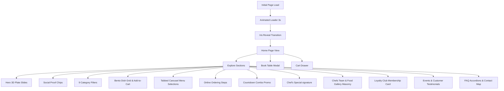
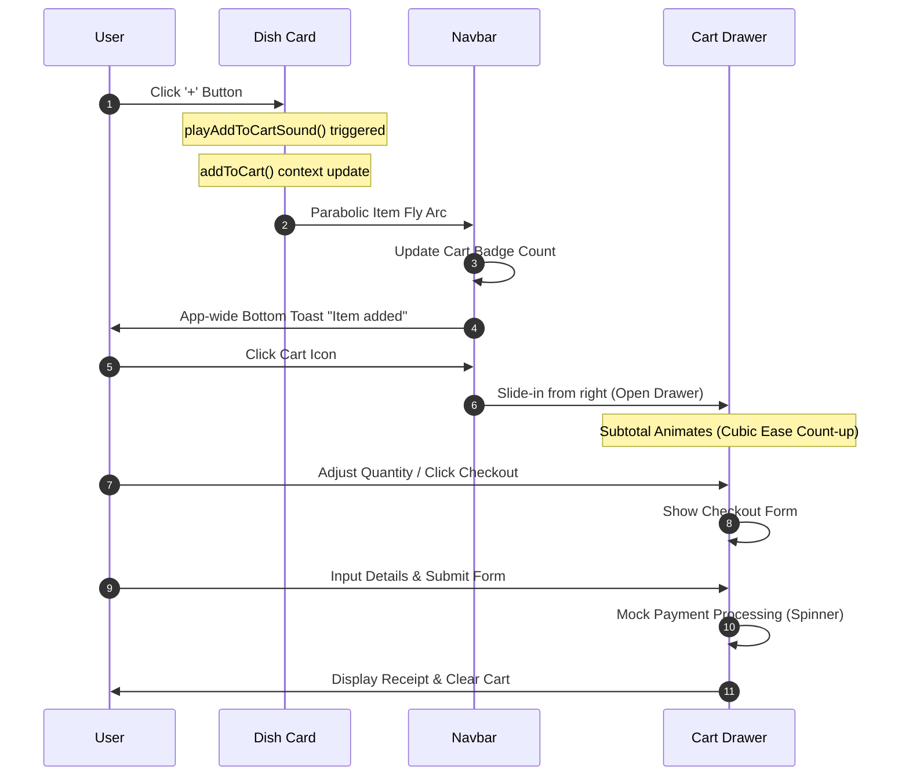

# 🗺️ Website Flow & Interactive Journeys

**Last updated: June 28, 2026**

This document details the user flows, state transformations, animations, and interactive paths available on the **Flavora Kitchen** landing page.

---

## 🧭 1. General Page Navigation Flow

Flavora Kitchen is built as a single-page application (SPA) with overlays and modals handling checkout and table bookings. The user journey follows a structured sequence:



### 1.1 Landing Page Sections (In Render Order)
1.  **Loader Overlay**: Entry branding and progress bar (3s progress, session-persistent).
2.  **AnnouncementBar**: Promotional top strip (dismissible).
3.  **Navbar**: Fixed layout header containing navigation links, audio toggle, and cart drawer trigger.
4.  **Hero**: Interactive 10-dish slider with letter reveal stagger, R3F plate breathing, and CTAs.
5.  **SocialProofBar**: Embedded highlights bar (ratings, awards, delivery zones).
6.  **Categories**: Balanced grid card indexing for 9 menu categories.
7.  **PopularDishes**: Interactive catalog grid (horizontal featured card, 3D mouse tilt).
8.  **MenuPreviewTabs**: Tabbed horizontal scroll carousel showing 10+ items per course.
9.  **OnlineOrdering**: Interactive ordering flow.
10. **SpecialOffers**: Countdown weekly combo discount promotion.
11. **ChefsSpecial**: Editorial magazine spread highlighting signature dish.
12. **MeetChefs**: Grid highlighting chef profiles (distinct chef portrait photos).
13. **FoodGallery**: 10-item Masonry bento grid with fullscreen lightbox overlays.
14. **InstagramFeed**: 6 window posts showing drag-scroll circles.
15. **StatsStrip**: Milestones count-up strip.
16. **LoyaltyTeaser**: 3D interactive gold VIP membership card details.
17. **Events**: Timeline drag-scroll cards.
18. **Reviews**: Customer reviews snap scroll rail over a burgundy banner.
19. **FAQ**: Chevron-rotating accordion answers.
20. **NewsletterSection**: Subscription box with checkmark animation.
21. **ContactLocation**: Form submission input + Google maps location frame + details.
22. **Footer**: WATERMARK signature overlay + quick navigation + social hover cubes.

---

## 🍕 2. Category Filtering Flow

While the categories grid and signature selections currently operate with visual states, the UI flow is designed to feel highly reactive:

```
Category Card Clicked (e.g., 'Pizza')
  +---> Set Active Category ID state
  +---> Trigger Framer Motion layout transition
  |       (Layout active accent bar slides to target card)
  +---> Adjust individual image drop-shadow intensity:
          - Active card image: High intensity colored glow drop-shadow
          - Inactive card images: Standard subtle ambient drop-shadow
```

---

## 🛒 3. The Cart & Checkout Flow

The cart workflow manages state synchronizations, visual indicators, audio feedback, and order generation.



### 3.1 Step-by-Step Cart Implementation Details

### Step 1: Adding an Item to the Cart
When a user clicks the `+` button on a card in [PopularDishes.tsx](file:///d:/Client%20Projects/foodie-flavors-restaurant-main/flavora-kitchen/src/components/PopularDishes.tsx) **or** [MenuPreviewTabs.tsx](file:///d:/Client%20Projects/foodie-flavors-restaurant-main/flavora-kitchen/src/components/MenuPreviewTabs.tsx):
1.  **State Insertion**: The dish object is added to the `CartContext` using the `addToCart(dish)` hook. If the item already exists in the cart, its quantity increment is handled automatically.
2.  **Sound Cue**: The synthesizer compiles and plays the *Add-to-Cart double chime* (`playAddToCartSound()`).
3.  **Parabolic Flying Arc** *(PopularDishes only)*: The click event coordinates are grabbed:
    *   *Start Coordinates*: Calculated from the `+` button's bounding client rect.
    *   *End Coordinates*: Calculated from the Navbar cart button (`#cart-btn`) bounding client rect.
    *   *Path Interpolation*: A duplicate thumbnail of the dish is spawned in the DOM. Framer Motion animates it along a parabolic arc:
        *   `left` translates from `startX` to `endX`.
        *   `top` follows a curved peak: `[startY, (startY + endY) / 2 - 160, endY]`.
        *   `scale` shrinks from `1.0` to `0.1` and `rotate` spins `360deg` over `0.85s`, landing directly inside the Navbar cart icon.
4.  **Confirmation Toast**: An app-wide bottom toast pops up from the bottom center, scales in, and auto-dismisses after `2000ms`. This triggers for **both** PopularDishes and MenuPreviewTabs add-to-cart actions.

#### Step 2: The Cart Drawer & Navigation Gating
When the user clicks the Navbar cart button or CTA links:
1.  **Auth Gating**: If unauthenticated, it opens the glassmorphic `AuthGateModal` to prompt signup or login.
2.  **Dashboard Redirection**: If authenticated, it slides open the sidebar and routes the user to the protected `/app` portal's **Checkout Hub** tab.
3.  **Quantity Adjustments**: Inside the Checkout Hub, users can click `+` or `-` buttons to modify quantities or click to empty items from the cart.

#### Step 3: Checkout Hub & Payment Options
Inside the Gated Checkout Hub (for a complete functional breakdown, see the [Gourmet Online Order System Guide](file:///d:/Client%20Projects/foodie-flavors-restaurant-main/documentation/online_order_system.md)):
1.  **Discount Coupons**: Entering coupon code `FLAVORA50` applies a 50% discount to the cart total.
2.  **Rider Tips**: Users can select custom tips (₹20, ₹30, ₹50) which are appended to the final sum.
3.  **Address & Coordinates**: Users select their saved address or create a new address. The address creator simulates GPS coordinate pin placement (random latitude and longitude maps mapping).
4.  **Payment Processing**: Supports UPI (ID validation), Cards (inputs card number, CVV, and name), COD, or split payment request simulations.

#### Step 4: Gated Live Tracking & Reorders
Once the order is placed (for a complete functional breakdown, see the [Live Telemetry & GPS Tracking Guide](file:///d:/Client%20Projects/foodie-flavors-restaurant-main/documentation/live_tracking_system.md)):
1.  **Live Timelines**: Transports the user directly to the **Live Track** tab. The order status advances (Placed ➔ Accepted ➔ Preparing ➔ Packed ➔ Out for Delivery ➔ Delivered) as coordinates progress.
2.  **Scooter Vector Maps**: An animated scooter emoji traverses the simulated SVG street layout in real-time.
3.  **History Logs**: Completed orders appear in the History Log ledger. Clicking "Reorder" loads the items back into the Checkout Hub.

---

## 📅 4. Table Reservation Flow

The table reservation system allows users to secure dine-in reservations through a focused booking sequence.

```
       Click CTA (Navbar / Hero / Chef's Special)
                          │
                          ▼
             ┌─────────────────────────┐
             │ Step 1: Input Booking   │
             │                         │
             │ - Guest Count Selector  │
             │ - Date Selection        │
             │ - Time Slot Drop-down   │
             │ - Contact Details Form  │
             └────────────┬────────────┘
                          │
                Validate & Submit
                          │
                          ▼
             ┌─────────────────────────┐
             │ Step 2: Ticket Receipt  │
             │                         │
             │ - Success Confirmation  │
             │ - Scalloped Ticket Card │
             │ - Summary of Selections │
             └─────────────────────────┘
```

### 4.1 Step 1: Booking Details
*   **Trigger**: Clicking booking buttons on the page sets the `reservationOpen` state to `true` in [App.tsx](file:///d:/Client%20Projects/foodie-flavors-restaurant-main/flavora-kitchen/src/App.tsx), loading the modal overlay.
*   **Guest Count Selector**: Clicking guest selectors (options `1, 2, 3, 4, 5, 6+`) updates the selected active state, highlighted in orange.
*   **Date Constraints**: The HTML5 date picker is initialized to the current date and sets the `min` constraint to today's date, preventing users from selecting dates in the past.
*   **Time Slot Selection**: Time slots are managed via an dropdown selection loaded with predefined Lunch and Dinner slots (`12:00 PM` to `10:00 PM`).
*   **Contact Verification**: Text inputs collect Full Name, Email, and Phone, validating inputs before enabling the confirm button.

### 4.2 Step 2: Booking Confirmation
*   **Submit Delay**: On submit, a spinner is displayed for `1500ms` to simulate database lookup.
*   **Ticket Rendering**: The modal advances to the confirmation ticket screen. The ticket mimics a boarding pass with scalloped circles on the sides and displays the guest count, reservation date, and time slot clearly.
*   **Dismissal Reset**: Clicking "Great, thank you!" closes the modal. After the fade-out transition concludes (`300ms`), all form inputs are cleared to return the modal to its initial state.

---

## 📅 5. Gated Dashboard Table Reservation Flow

Within the authenticated `/app` portal under the **Table Bookings** tab, users navigate an advanced 12-module scheduling engine (for full functional details, see the [Dine-In Table Seating Reservation Guide](file:///d:/Client%20Projects/foodie-flavors-restaurant-main/documentation/table_booking_system.md)):

### 5.1 Scheduling & Availability Engine (Modules 3 & 5)
- **Time Slots Grid**: Selects dates and queries available slots. Booked slots are displayed in red, available slots in green.
- **Waitlist Queue (Module 12)**: Clicking a booked-out slot prompts the user to join the waitlist. It tracks their queue position and automatically promotes them to "Confirmed" if a cancellation occurs.

### 5.2 Seating Floor Layout selection (Module 4)
- **Interactive 2D Grid**: Shows a physical map layout of tables (Table 01 to 06) depending on the selected table category (Couple, Family, Cabin, Rooftop, Outdoor, Window, VIP).
- **Node selection**: Users select an available table node (glow outline) or see booked nodes in red (disabled).

### 5.3 Special Requests & Check-In SVGs (Modules 6, 7, 8 & 9)
- **Package selection**: Adds party packages (Romantic, Family, Tasting, Chef Experience) and special request checklists.
- **Check-in Tickets**: Generates booking IDs and SVG QR check-in codes. Timeline reminders (24h/2h status logs) are populated.

### 5.4 Seating Management & Post-Dining Scorecards (Modules 10, 13 & 14)
- **Management actions**: Allows users to Reschedule dates/times, Upgrade table types, Add Guests headcount, or Cancel bookings.
- **Simulated Host scanner**: Clicking "Simulate QR Check-In" shifts status to "Seated". Completing meals shifts status to "Completed" and opens the post-dining rating scorecard.
- **Reviews Scorecard**: Users submit Food, Ambience, and Service Quality ratings (1-5 stars) and comments which are saved in the completed history log.

---

---

## 🔊 5. Audio UX & Mute Synchronization Flow

The sound feedback system maintains user preferences across page sessions.

```
                  Page Mounted (App.tsx)
                            │
                            ▼
             ┌─────────────────────────────┐
             │ Read flavora_muted Key      │
             │ from localStorage           │
             └──────────────┬──────────────┘
                            │
                  Parsed Value Check
                            │
             ┌──────────────┴──────────────┐
             │                             │
       Stored = "true"               Stored = "false"
             │                             │
             ▼                             ▼
       Set isMuted = True            Set isMuted = False
             │                             │
             ▼                             ▼
       Navbar Speaker:               Navbar Speaker:
        VolumeX (Mute)               Volume2 (Active)
```

### State Sync Events:
*   **Toggle Event**: Clicking the speaker icon in the Navbar toggles the global mute state and stores the updated preference in `localStorage.setItem("flavora_muted", String(muted))`.
*   **Interactive Safeguard**: Audio synthesis functions (`playAddToCartSound`, `playDrawerOpenSound`, `playTickSound`) query the mute status before executing Web Audio logic. If `isMuted` is `true`, they return immediately, saving processor cycles and preventing unexpected sound output.

---

## 🔖 Tier 1 Dashboard Extension Flows (June 2026)

### T1.1 Wishlist / Favorites Flow
```
User opens Dashboard → Menu tab
└→ Clicks ♥ heart icon on a dish card
   ├→ FavoritesContext.toggleFavorite(dishId) called
   ├→ Icon fills solid (isFavorited = true)
   └→ localStorage("flavora_favorites") updated

User navigates to Favorites tab
└→ favorites[] filtered from DISH_DATA for matching IDs
└→ Renders favorited dish grid with ♥ remove toggle
└→ "Add to Cart" button on each favorited dish works normally
```

### T1.2 Order History — Invoice Download & Repeat Order Flow
```
User opens Dashboard → History tab → Past Order card
├→ "Download Invoice" button:
   ├→ jsPDF instantiates a new A4 PDF document
   ├→ Renders: Flavora Kitchen header, order ID, date, itemized list, fees, total
   └→ Triggers browser "Save As" dialog (Flavora_Invoice_{id}.pdf)
└→ "Repeat Order" button:
   ├→ Iterates order.items, calls addToCart() for each
   └→ Toast: "Order repeated! {N} items added to cart"
```

### T1.3 Extended Voucher & Referral Flow
```
User on Signup page → enters referral code in optional field
└→ On success: localStorage("flavora_applied_referral") = referralCode

User lands on Dashboard (first mount)
├→ useEffect checks: flavora_applied_referral exists AND flavora_referral_welcomed != "true"
├→ Applies WELCOME100 voucher to checkout state automatically
└→ 1.5s delayed toast: "Welcome! ₹100 off your first order applied!"
└→ Sets flavora_referral_welcomed = "true" (prevents re-trigger)

User in Checkout tab → enters coupon code
├→ Validated against VOUCHERS config array
├→ percent: discountAmount = round(cartTotal × value/100)
├→ flat: discountAmount = min(cartTotal, value)
└→ free_shipping: deliveryFee overridden to 0
```

### T1.4 Upsell Strip — "Complete Your Meal" Flow
```
User adds first Main Course dish to cart
└→ useEffect triggers: cart.length === 1 && lastCartLength === 0
   └→ dish.category === "Main Course" → finds top-rated Starter
      └→ showUpsell = true, upsellSuggestion = starter dish

Strip animates in from top with spring motion:
├→ "+ Add" → addToCart(suggestion), plays chime, closes strip, shows toast
└→ X button → showUpsell = false (no cart side effects)
```

---

## 🔗 Tier 2 Dashboard Extension Flows (June 2026)

### T2.1 Customer Profile Flow
```
User navigates to Profile tab
└→ Reads: localStorage("flavora_profile") → populates form
   (fallback: auth user name + email on first load)

├→ View mode: Glass card showing name, phone, birthday, preferences
└→ Edit mode (pencil button):
   ├→ Inline form inputs appear
   ├→ User edits: name, phone, birthday, dietary pref, allergens, payment pref
   └→ Save: persists to localStorage, toast "Profile updated!"

Profile photo:
└→ Click camera icon → handleSimulatePhotoUpload() → toast "Photo updated!"
```

### T2.2 Delivery Zone Validation Flow
```
User in Checkout tab → selects an address from savedAddresses[]
└→ useEffect: selectedAddressId changes
   └→ getDeliveryZone(address.coords) called
      └→ haversineKm(restaurantCoords, address.coords) calculated
         ├→ ≤0-3km: in_zone → ₹0 fee, 15-20min ETA
         ├→ 3-7km: mid_zone → ₹40 fee, 25-35min ETA
         ├→ 7-12km: far_zone → ₹80 fee, 40-55min ETA
         ├→ 12-20km: far_zone → ₹140 fee, 60-75min ETA
         └→ >20km: out_of_zone → warning banner, checkout blocked
   └→ deliveryFee state updated → invoice totals recalculate live
```

### T2.3 Dining Waitlist Flow
```
User in Bookings tab → selects a time slot marked "Fully Booked"
└→ CTA: "Join Waitlist" → opens compact inline form
   └→ User fills name, phone, guest count → submits
      └→ WaitlistEntry created: { position: N, status: "waiting" }
         └→ Toast: "You're #N in the waitlist!"

Background useEffect (15s interval):
└→ Finds first entry with status: "waiting"
   └→ Transitions to status: "ready"
      └→ Toast: "🎉 Your table is ready!"

Host panel:
└→ "Mark Seated" button → status: "seated"
```

### T2.4 Inventory / Availability Flow
```
DASH_STOCK map initialized at DashboardPage mount:
└→ Each dish ID → "available" | "low" | "sold_out"

Menu tab renders each dish card:
├→ sold_out: Red "Sold Out" overlay pill → Add button disabled
├→ low: Amber "Low Stock" badge → Add button enabled with warning toast
└→ available: Normal render, no badge
```

### T2.5 Group Ordering Flow
```
User in Checkout tab → clicks "Group Order"
└→ groupOrderActive = true
   └→ Share link generated: flavora.menu/group?s={timestamp}
      └→ Copyable URL input displayed

"+ Simulate Guest Join" button:
└→ Adds mock GroupOrderMember with random sample items
   └→ Member roster updates live
   └→ Split billing recalculates: grandTotal / members.length per head

Each member card:
├→ Shows name, item list, subtotal
└→ ✅ Paid / ⏳ Pending badge (manually toggleable)
```
